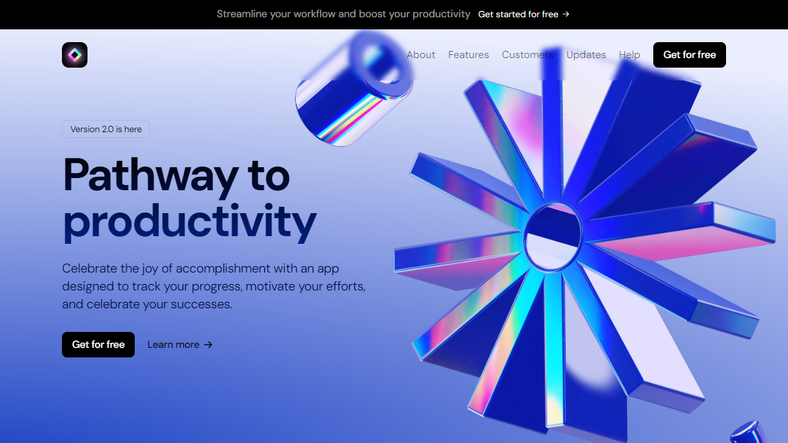

This is a sample landing page for a SAAS. I built it with [NextJS](https://nextjs.org/), [TailwindCSS](https://tailwindcss.com/) and [Framer Motion](https://www.framer.com/motion/).

Beautiful gradients and thoughfully implemented animations draw the user's attention to important information on the page, making sure that they don't just skim through.

Parallax effects and automatically scrolling carousels set the webpage a class apart from generic landing pages, providing a pleasant and memorable user experience.
